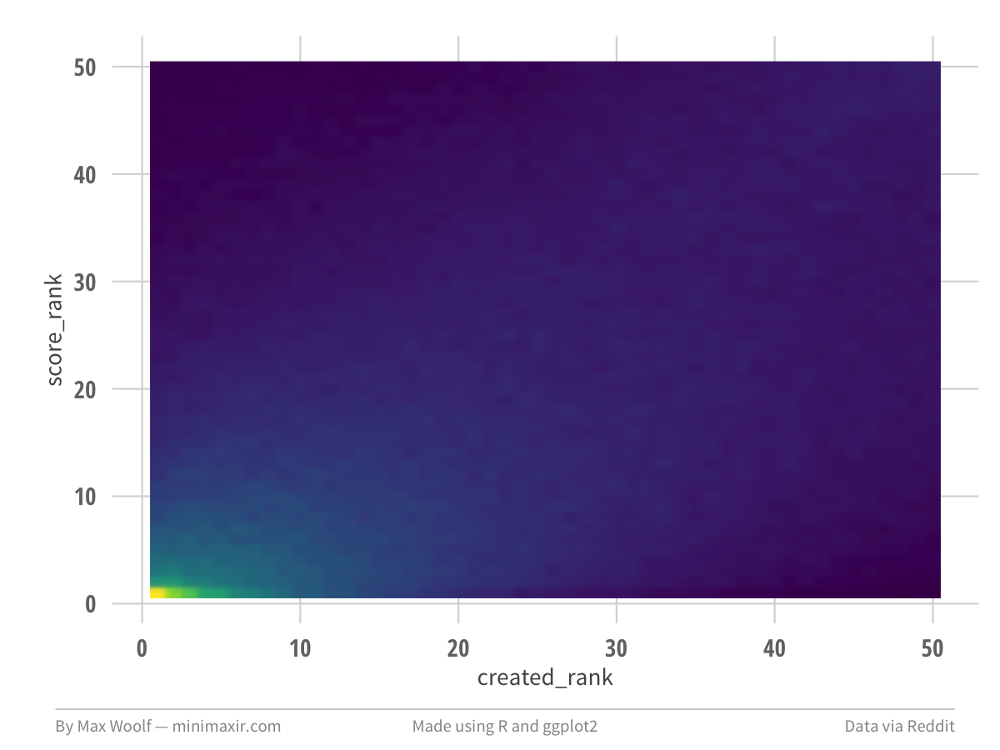

This is an [R Markdown](http://rmarkdown.rstudio.com) Notebook. When you execute code within the notebook, the results appear beneath the code. 

Try executing this chunk by clicking the *Run* button within the chunk or by placing your cursor inside it and pressing *Cmd+Shift+Enter*. 

```{r}
source("Rstart.R")
library(viridis)
```

```sql
SELECT created_rank, score_rank,
COUNT(*) as num_comments
FROM
(
SELECT 
subreddit,
ROW_NUMBER() OVER (PARTITION BY link_id ORDER BY score DESC) AS score_rank, 
ROW_NUMBER() OVER (PARTITION BY link_id ORDER BY created_utc ASC) AS created_rank,
COUNT(*) OVER (PARTITION BY link_id) AS num_comments_in_thread
FROM [fh-bigquery:reddit_comments.all_starting_201501]
WHERE link_id = parent_id
AND LOWER(subreddit) = "askreddit"
)
WHERE score_rank <= 100 AND created_rank <= 100 AND num_comments_in_thread >= 100
GROUP BY created_rank, score_rank
ORDER BY created_rank, score_rank
```


```{r}
df <- read_csv("reddit_all_052015_askreddit.csv")

df %>% head(1000)
```

```{r}
plot <- ggplot(df %>% filter(created_rank <= 50, score_rank <= 50), aes(x=created_rank, y=score_rank, fill=num_comments)) +
            geom_raster(interpolate = TRUE) +
            fte_theme() +
            scale_fill_viridis()

max_save(plot, "reddit-first", "Reddit")
```

