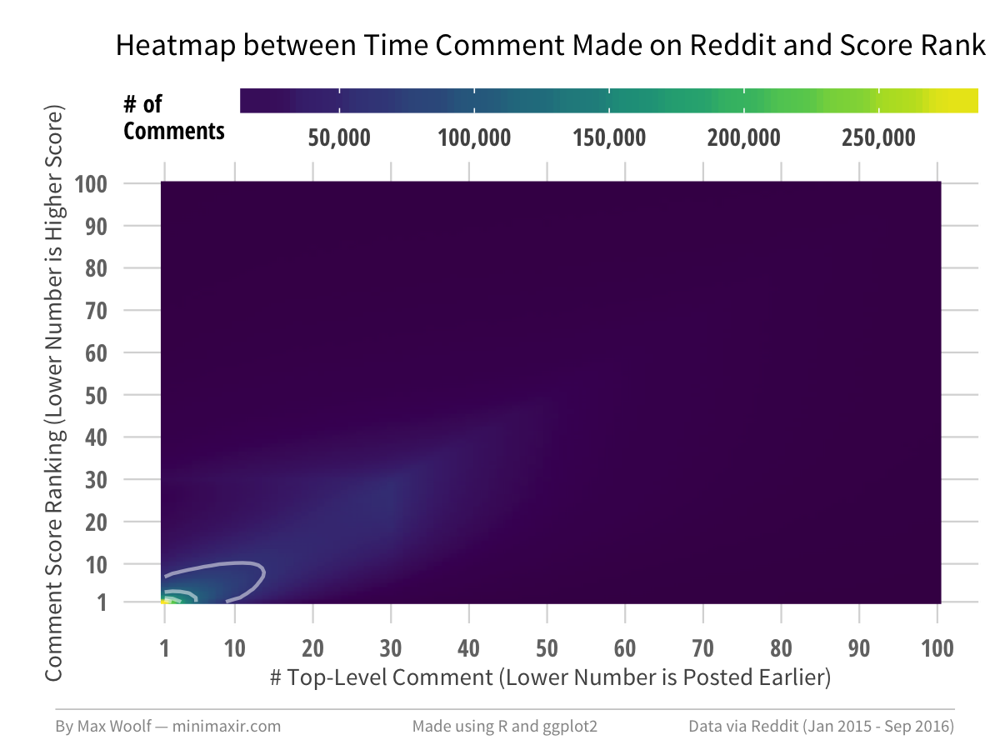
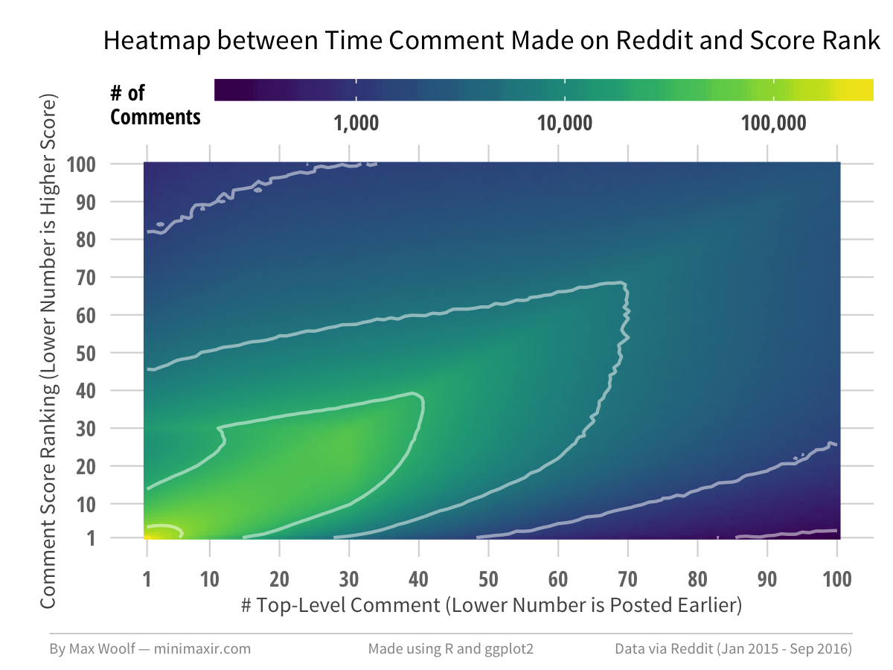
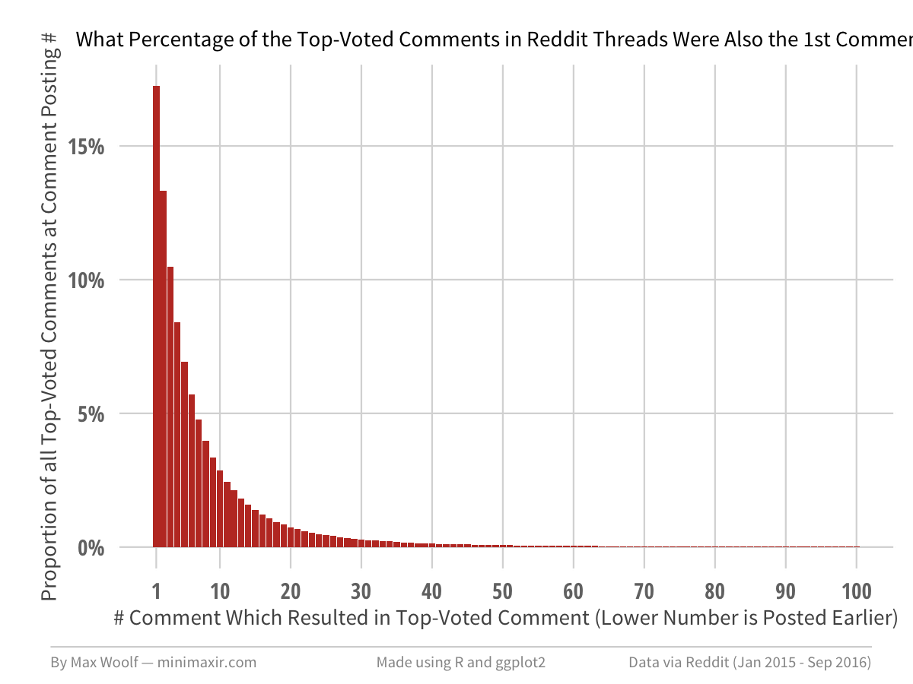
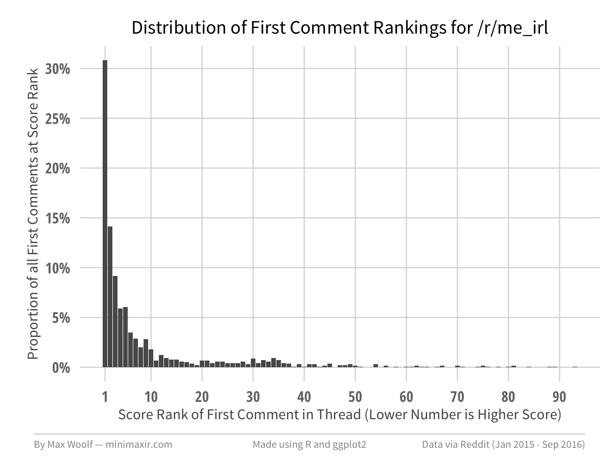
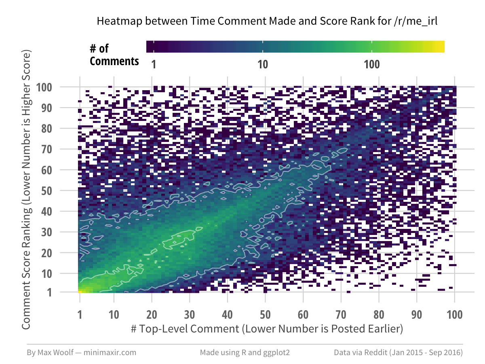

This R Notebook is the complement to my blog post [What Percent of the Top-Voted Comments in Reddit Threads Were Also 1st Comment?](http://minimaxir.com/2016/11/first-comment/).

This notebook is licensed under the MIT License. If you use the code or data visualization designs contained within this notebook, it would be greatly appreciated if proper attribution is given back to this notebook and/or myself. Thanks! :)

# Setup

Setup the R packages.

```{r}
source("Rstart.R")
library(viridis)
library(plotly)
library(bigrquery)
library(htmlwidgets)
```

This project uses data from [BigQuery](https://cloud.google.com/bigquery/). To get the data for the first charts, run this query:

```sql
SELECT created_rank, score_rank,
COUNT(*) as num_comments
FROM
(
SELECT 
subreddit,
ROW_NUMBER() OVER (PARTITION BY link_id ORDER BY score DESC) AS score_rank, 
ROW_NUMBER() OVER (PARTITION BY link_id ORDER BY created_utc ASC) AS created_rank,
COUNT(*) OVER (PARTITION BY link_id) AS num_toplevelcomments_in_thread
FROM [fh-bigquery:reddit_comments.all_starting_201501]
WHERE link_id = parent_id
)
WHERE score_rank <= 100 AND created_rank <= 100 AND num_toplevelcomments_in_thread >= 30
GROUP BY created_rank, score_rank
ORDER BY created_rank, score_rank
```

* `ROW_NUMBER()` must be used instead of `RANK()` to avoid biasing ties in score.
* `COUNT() OVER (PARTITION BY link_id)` returns the number of toplevel comments in the thread where that comment is located; the outerlevel filter then filters the output on that.
* `WHERE link_id = parent_id` corresponds to top-level comments

This outputs a 10,000 row file.

# Exploratory Analysis

```{r}
df <- read_csv("reddit_012015_all.csv")

df %>% head()
```

The total number of comments analyzed is **n = `r df %>% select(num_comments) %>% sum() %>% format(big.mark=",")`**.

Plot a basic 2x2 heat map. A `log10()` filter is likely necessary to compress the values.

```{r}
plot <- ggplot(df, aes(x=created_rank, y=score_rank, fill=log10(num_comments))) +
            geom_raster(interpolate = TRUE) +
            fte_theme() +
            scale_fill_viridis()

max_save(plot, "reddit-first", "Reddit")
```


Optimize axes/parameters and add a contour to visualize groupings. (use non-log filter for posterity)

```{r}
plot <- ggplot(df, aes(x=created_rank, y=score_rank, fill=num_comments, z=num_comments)) +
            geom_raster(interpolate = TRUE) +
            geom_contour(color = "white", alpha = 0.5, bins = 5) +
            scale_x_continuous(breaks = c(1,seq(10,100,by=10))) +
            scale_y_continuous(breaks = c(1,seq(10,100,by=10))) +
            fte_theme() +
            theme(legend.title = element_text(size=7, family="Open Sans Condensed Bold"), legend.position="top", legend.direction="horizontal", legend.key.width=unit(1.5, "cm"), legend.key.height=unit(0.25, "cm"), legend.margin=unit(0,"cm"), panel.margin=element_blank()) +
            scale_fill_viridis(name="# of\nComments", labels=comma, breaks=pretty_breaks(6)) +
            labs(title = "Heatmap between Time Comment Made on Reddit and Score Rank",
                 x = "# Top-Level Comment (Lower Number is Posted Earlier)",
                 y = "Comment Score Ranking (Lower Number is Higher Score)")

max_save(plot, "reddit-first-2", "Reddit (Jan 2015 - Sep 2016)")
```



Remake the plot using a `log10` scale.

```{r}
plot <- ggplot(df, aes(x=created_rank, y=score_rank, fill=num_comments, z=log10(num_comments))) +
            geom_raster(interpolate = TRUE) +
            geom_contour(color = "white", alpha = 0.5, bins = 5) +
            scale_x_continuous(breaks = c(1,seq(10,100,by=10))) +
            scale_y_continuous(breaks = c(1,seq(10,100,by=10))) +
            fte_theme() +
            theme(legend.title = element_text(size=7, family="Open Sans Condensed Bold"), legend.position="top", legend.direction="horizontal", legend.key.width=unit(1.5, "cm"), legend.key.height=unit(0.25, "cm"), legend.margin=unit(0,"cm"), panel.margin=element_blank()) +
            scale_fill_viridis(name="# of\nComments", labels=comma, breaks=10^(2:5), trans="log10") +
            labs(title = "Heatmap between Time Comment Made on Reddit and Score Rank",
                 x = "# Top-Level Comment (Lower Number is Posted Earlier)",
                 y = "Comment Score Ranking (Lower Number is Higher Score)")

max_save(plot, "reddit-first-2a", "Reddit (Jan 2015 - Sep 2016)")
```



Filter on only the first comments to create 1D slice of the proportions.

```{r}
df_first_comment <- df %>% filter(created_rank == 1) %>%
                        mutate(norm = num_comments/sum(num_comments))

df_first_comment %>% select(score_rank, norm) %>% head()
```

The aggregate accounts for *n = `r df_first_comment %>% select(num_comments) %>% sum() %>% format(big.mark = ",")`* first comments.

The total proportion of the top 5 ranks is `r df_first_comment %>% select(norm) %>% head(5) %>% sum() %>% round(2)`, and the top 10 ranks is `r df_first_comment %>% select(norm) %>% head(10) %>% sum() %>% round(2)`.

```{r}
plot <- ggplot(df_first_comment, aes(x=score_rank, y=norm)) +
            geom_bar(stat = "identity", fill = "#2980b9") +
            scale_x_continuous(breaks = c(1,seq(10,100,by=10))) +
            scale_y_continuous(labels = percent, breaks=pretty_breaks(6)) +
            fte_theme() +
            theme(plot.title = element_text(size=6)) +
            labs(title = "What Percentage of the 1st Comments in Reddit Threads Were Also the Top-Voted Comment?",
                 x = "Score Rank of First Comment in Thread (Lower Number is Higher Score)",
                 y = "Proportion of all First Comments at Score Rank")

max_save(plot, "reddit-first-3", "Reddit (Jan 2015 - Sep 2016)")
```


Invert the dataframe to arrange by Top Comment (this should be symmetric, per the 2D map).

```{r}
df_top_comment <- df %>% filter(score_rank == 1) %>%
                        mutate(norm = num_comments/sum(num_comments))

df_top_comment %>% head()
```

The aggregate accounts for *n = `r df_top_comment %>% select(num_comments) %>% sum() %>% format(big.mark = ",")`* first comments.

The total proportion of the top 5 ranks is `r df_top_comment %>% select(norm) %>% head(5) %>% sum() %>% round(2)`, and the top 10 ranks is `r df_top_comment %>% select(norm) %>% head(10) %>% sum() %>% round(2)`.

```{r}
plot <- ggplot(df_top_comment, aes(x=created_rank, y=norm)) +
            geom_bar(stat = "identity", fill = "#c0392b") +
            scale_x_continuous(breaks = c(1,seq(10,100,by=10))) +
            scale_y_continuous(labels = percent, breaks=pretty_breaks(6)) +
            fte_theme() +
            theme(plot.title = element_text(size=6)) +
            labs(title = "What Percentage of the Top-Voted Comments in Reddit Threads Were Also the 1st Comment?",
                 x = "# Comment Which Resulted in Top-Voted Comment (Lower Number is Posted Earlier)",
                 y = "Proportion of all Top-Voted Comments at Comment Posting #")

max_save(plot, "reddit-first-4", "Reddit (Jan 2015 - Sep 2016)")
```


# Analyze by Subreddits
## Get Subreddit Data from BigQuery

Create same charts as above for Top 100 Subreddits by unique active commenters. Must use R to get data since too many rows returned. 

```{r, eval=FALSE}
project_id <- <FILL IN>   # DO NOT SHARE!
```

This requires a subquery tweak on the first query to filter on top 100 subreddits, and include in output:

```sql
SELECT subreddit, created_rank, score_rank,
COUNT(*) as num_comments
FROM
(
SELECT 
subreddit,
ROW_NUMBER() OVER (PARTITION BY link_id ORDER BY score DESC) AS score_rank, 
ROW_NUMBER() OVER (PARTITION BY link_id ORDER BY created_utc ASC) AS created_rank,
COUNT(*) OVER (PARTITION BY link_id) AS num_toplevelcomments_in_thread
FROM [fh-bigquery:reddit_comments.all_starting_201501]
WHERE link_id = parent_id AND subreddit IN
    (SELECT subreddit FROM (SELECT subreddit, COUNT(DISTINCT author) as unique_commenters,
        FROM [fh-bigquery:reddit_comments.all_starting_201501]
        GROUP BY subreddit
        ORDER BY unique_commenters DESC
        LIMIT 100)
    )
)
WHERE score_rank <= 100 AND created_rank <= 100 AND num_toplevelcomments_in_thread >= 30
GROUP BY subreddit, created_rank, score_rank
ORDER BY subreddit, created_rank, score_rank
```

Query with R and save output for later.

```{r, eval=FALSE}
query <- "SELECT subreddit, created_rank, score_rank,
COUNT(*) as num_comments
FROM
(
SELECT 
subreddit,
ROW_NUMBER() OVER (PARTITION BY link_id ORDER BY score DESC) AS score_rank, 
ROW_NUMBER() OVER (PARTITION BY link_id ORDER BY created_utc ASC) AS created_rank,
COUNT(*) OVER (PARTITION BY link_id) AS num_toplevelcomments_in_thread
FROM [fh-bigquery:reddit_comments.all_starting_201501]
WHERE link_id = parent_id AND subreddit IN
    (SELECT subreddit FROM (SELECT subreddit, COUNT(DISTINCT author) as unique_commenters,
        FROM [fh-bigquery:reddit_comments.all_starting_201501]
        GROUP BY subreddit
        ORDER BY unique_commenters DESC
        LIMIT 100)
    )
)
WHERE score_rank <= 100 AND created_rank <= 100 AND num_toplevelcomments_in_thread >= 30
GROUP BY subreddit, created_rank, score_rank
ORDER BY subreddit, created_rank, score_rank"

df_subreddits <- tbl_df(query_exec(query, project=project_id, max_pages=Inf))
df_subreddits %>% head()
```

```{r, eval=FALSE}
write.csv(df_subreddits, "reddit_012015_by_subreddit.csv", row.names=F)
```

Read from cached output.

```{r}
df_subreddits <- read_csv("reddit_012015_by_subreddit.csv")
```

The returned file has **`r df_subreddits %>% nrow() %>% format(big.mark=',')`** rows and takes **`r df_subreddits %>% object.size() %>% format(units = 'MB')`** of memory in R.

Remake the `df_first_comment` data frame with the subreddit data as well:

```{r}
df_first_comment_subreddit <- df_subreddits %>% filter(created_rank == 1) %>%
                        group_by(subreddit) %>%
                        mutate(norm = num_comments/sum(num_comments))

df_first_comment_subreddit %>% head()
```


## Visualize Subreddit Data

Create the 1D Map and the 2D Map for each subreddit using variants code above. First, extract a list of the top 100 subreddits used above.

```{r}
subreddits <- df_subreddits %>% select(subreddit) %>% unique() %>% unlist()
subreddits %>% head()
```

Create a wrapper function, which given a subreddit, produces the chart for that subreddit. (assumes `img-1d` and `img-2d` directories exist)

### 1D Charts for Top 100 Subreddits

```{r}
subreddit_1d <- function(p_subreddit) {
plot <- ggplot(df_first_comment_subreddit %>% filter(subreddit == p_subreddit), aes(x=score_rank, y=norm)) +
            geom_bar(stat = "identity") +
            scale_x_continuous(breaks = c(1,seq(10,100,by=10))) +
            scale_y_continuous(labels = percent, breaks=pretty_breaks(6)) +
            fte_theme() +
            labs(title = sprintf("Distribution of First Comment Rankings for /r/%s", p_subreddit),
                 x = "Score Rank of First Comment in Thread (Lower Number is Higher Score)",
                 y = "Proportion of all First Comments at Score Rank")

max_save(plot, sprintf("img-1d/%s-1d", p_subreddit), "Reddit (Jan 2015 - Sep 2016)")
}
```

Run for each of the 100 subreddits.

```{r}
temp <- lapply(subreddits, subreddit_1d)
```




### 2D Charts for Top 100 Subreddits

```{r}
subreddit_2d <- function(p_subreddit) {
plot <- ggplot(df_subreddits %>% filter(subreddit == p_subreddit), aes(x=created_rank, y=score_rank, fill=num_comments, z=log10(num_comments))) +
            geom_raster(interpolate = FALSE) +
            geom_contour(color = "white", alpha = 0.5, bins = 3, size = 0.25) +
            scale_x_continuous(breaks = c(1,seq(10,100,by=10))) +
            scale_y_continuous(breaks = c(1,seq(10,100,by=10))) +
            fte_theme() +
            theme(plot.title = element_text(size=7)) +
            theme(legend.title = element_text(size=7, family="Open Sans Condensed Bold"), legend.position="top", legend.direction="horizontal", legend.key.width=unit(1.5, "cm"), legend.key.height=unit(0.25, "cm"), legend.margin=unit(0,"cm"), panel.margin=element_blank()) +
            scale_fill_viridis(name="# of\nComments", labels=comma, breaks=10^(1:4), trans="log10") +
            labs(title = sprintf("Heatmap between Time Comment Made and Score Rank for /r/%s", p_subreddit),
                 x = "# Top-Level Comment (Lower Number is Posted Earlier)",
                 y = "Comment Score Ranking (Lower Number is Higher Rank)")

max_save(plot, sprintf("img-2d/%s-2d", p_subreddit), "Reddit (Jan 2015 - Sep 2016)")
}
```

```{r}
temp <- lapply(subreddits, subreddit_2d)
```



# Plotly

Do Plotly separately since it requires certain parameters for it to be implemented at minimaxir.com. *(The final interactive plot is not used in the post since it doesn't add much)*

```{r}
theme_color <- "#f7f8fa"

plotly_theme <- function() {
                theme(plot.background=element_rect(fill=theme_color), 
                  panel.background=element_rect(fill=theme_color),
                  panel.border=element_rect(color=theme_color),
                  strip.background=element_rect(fill=theme_color))
}
```


```{r}
plot <- ggplot(df_first_comment, aes(x=score_rank, y=norm)) +
            geom_bar(stat = "identity") +
            scale_x_continuous(breaks = c(1,seq(10,100,by=10))) +
            scale_y_continuous(labels = percent, breaks=pretty_breaks(6)) +
            fte_theme() +
            plotly_theme() +
            theme(plot.title = element_text(size=7)) +
            labs(title = "What Percentage of the Top Comments in Reddit Threads Were Also 1st Comment?",
                 subtitle = "Proportion of Score Rankings for First Comment",
                 x = "Score Rank of First Comment in Thread (Lower Number is Higher Score)",
                 y = "Proportion of all First Comments at Score Rank")


plot <- plot %>%
        ggplotly() %>% 
        saveWidget("reddit-first-1d.html", selfcontained=F, libdir="plotly")
```


# LICENSE

The MIT License (MIT)

Copyright (c) 2016 Max Woolf

Permission is hereby granted, free of charge, to any person obtaining a copy of this software and associated documentation files (the "Software"), to deal in the Software without restriction, including without limitation the rights to use, copy, modify, merge, publish, distribute, sublicense, and/or sell copies of the Software, and to permit persons to whom the Software is furnished to do so, subject to the following conditions:

The above copyright notice and this permission notice shall be included in all copies or substantial portions of the Software.

THE SOFTWARE IS PROVIDED "AS IS", WITHOUT WARRANTY OF ANY KIND, EXPRESS OR IMPLIED, INCLUDING BUT NOT LIMITED TO THE WARRANTIES OF MERCHANTABILITY, FITNESS FOR A PARTICULAR PURPOSE AND NONINFRINGEMENT. IN NO EVENT SHALL THE AUTHORS OR COPYRIGHT HOLDERS BE LIABLE FOR ANY CLAIM, DAMAGES OR OTHER LIABILITY, WHETHER IN AN ACTION OF CONTRACT, TORT OR OTHERWISE, ARISING FROM, OUT OF OR IN CONNECTION WITH THE SOFTWARE OR THE USE OR OTHER DEALINGS IN THE SOFTWARE.